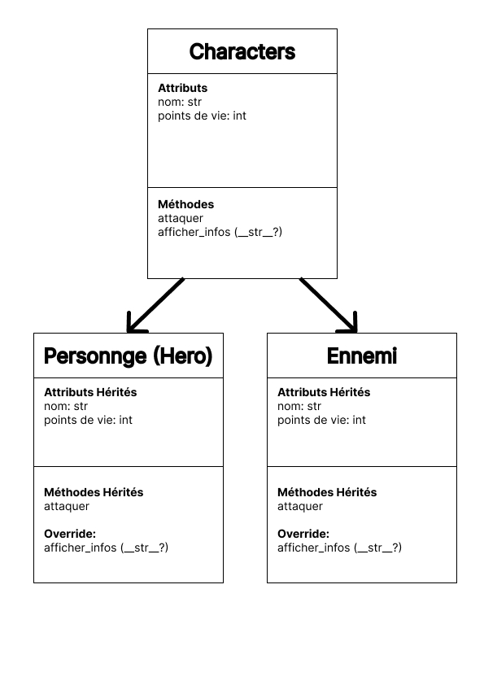

# demande :

## Partie 1 - MVP (Minimum Viable Product)

1. Créez un jeu en ligne de commande avec un personnage et un ennemi.
2. Le personnage a un nom, des points de vie (PV) et peut attaquer.
3. L'ennemi a un nom, des PV et peut attaquer.
4. Le jeu débute avec le personnage qui affronte un ennemi.
5. Affichez les informations sur le personnage et l'ennemi, et permettez au joueur de choisir d'attaquer l'ennemi.

## Partie 2 - Ajouts potentiels

6. Améliorez le jeu en ajoutant une fonctionnalité qui permet à l'ennemi d'attaquer le personnage. // attaque à chaque coup ?
7. Introduisez des statistiques pour le personnage, telles que des dégâts supplémentaires, des points de vies supplémentaire, et les points d'expérience (XP). // Attaquer ou rechercher un objet
8. Introduisez un système de niveau pour le personnage.
9. Permettez au personnage de gagner de l'expérience à la fin de chaque combat gagné contre un ennemi et de monter en niveau.
10. Dans le cas ou le combat est perdu, le personnage perd un niveau.Partie 3 - Fonctionnalités Premium
11. Ajoutez un inventaire pour le personnage.
12. Introduisez des objets, tels que des potions de soin qui restaurent les points de vie (PV) du personnage.
13. Permettez au personnage d'équiper des articles, tels que des armes ou des armures, pour améliorer ses statistiques.
14. Limitez le personnage à un type d'équipement (casque, armure, arme, etc.) par emplacement, offrant un choix stratégique au joueur.
15. Implémentez un système de sauvegarde et de chargement de la partie, permettant au joueur de revenir à sa progression précédente. z

# To do

- [ ] modifier a début du jeu : utilisation du nom du héro puis utilisation du vous.
- [ ] Dommage, vous avez perdu un niveau. \_ Vous êtes de retour au niveau 0!

Que voulez-vous faire : A - Attaquer B - rechercher un objet C - utiliser un objet

- [ ] trouver plus facilement une potion
- [ ] C : ne marche pas changement list_inventory
- [ ] 
